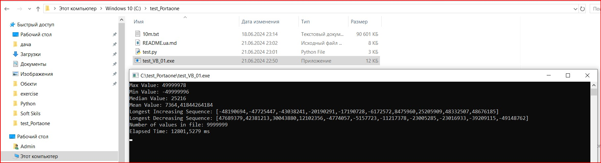

Програма написана на мові Visual Basic (VB) для аналізу великого набору цілих чисел з файлу `10m.txt`. Вона знаходить наступні шість значень:

1. Максимальне число в файлі.
2. Мінімальне число в файлі.
3. Медіану.
4. Середнє арифметичне значення.
5. Найбільшу послідовність чисел, яка збільшується.
6. Найбільшу послідовність чисел, яка зменшується.

## Опис коду

### Імпорт бібліотеки (рядок 1)
Імпортується бібліотека `System.IO` для роботи з файлами.

### Основний модуль програми (рядок 3)
Основний модуль програми, де оголошені всі функції та методи.

### Головна процедура `Main` (рядки 5-31)
Цей код задає шлях до файлу, читає дані, обчислює статистичні показники, знаходить найдовші зростаючі та спадні послідовності, виводить результати і вимірює час виконання.

### Функція `ReadFile` (рядки 33-45)
Функція читає файл і повертає список чисел. Вона відкриває файл, читає всі рядки, перетворює їх на цілі числа і зберігає в списку `data`.

### Функція `CalculateStatistics` (рядки 47-55)
Функція обчислює та повертає основні статистичні показники для списку `data`: максимальне значення, мінімальне значення, медіану та середнє значення.

### Функція `CalculateMedian` (рядки 57-65)
Функція обчислює медіану списку `data`.

### Функція `FindLongestIncreasingSequence` (рядки 67-89)
Функція знаходить найдовшу зростаючу послідовність у списку `data`.

### Функція `FindLongestDecreasingSequence` (рядки 91-113)
Функція аналогічна попередній, але знаходить найдовшу спадну послідовність у списку `data`.

## Інструкція з запуску

### 1. Налаштування Visual Studio та VB
#### Встановіть Visual Studio
- Перейдіть на [офіційний сайт Visual Studio](https://visualstudio.microsoft.com/) та завантажте інсталяційний файл для вашої операційної системи.
- Встановіть Visual Studio, дотримуючись інструкцій на екрані. Під час інсталяції виберіть робоче навантаження ".NET desktop development".

### 2. Підготовка файлу з числами
#### Створіть файл з числами
- Відкрийте будь-який текстовий редактор (наприклад, Notepad або Notepad++).
- Введіть список чисел, кожне число на новому рядку.
- Збережіть файл під назвою `10m.txt` (або іншим, що вам підходить) у теці `C:\test_Portaone\10m.txt`.

### 3. Підготовка та запуск коду
#### Створіть новий проект у Visual Studio
- Відкрийте Visual Studio.
- Створіть новий проект: "File" -> "New" -> "Project".
- Виберіть "Console App (.NET Framework)" і назвіть його, наприклад, "NumberAnalysis".

#### Вставте код у проект
- Відкрийте файл `Module1.vb`.
- Вставте у файл код програми.

#### Перевірте шлях до файлу
- Переконайтеся, що шлях до файлу `10m.txt` у змінній `filename` правильний. Він має бути таким:
```vbnet
Dim filename As String = "C:\test_Portaone\10m.txt"

Запустіть код
Натисніть F5 для запуску програми або виберіть "Debug" -> "Start Debugging" з меню.
4. Перегляд результатів
Після запуску коду, у консолі з'являться результати обчислень:

Максимальне значення
Мінімальне значення
Медіанне значення
Середнє значення
Найдовша зростаюча послідовність
Найдовша спадна послідовність
Кількість чисел у файлі
Час виконання

Це завершить процес запуску та аналізу даних.
